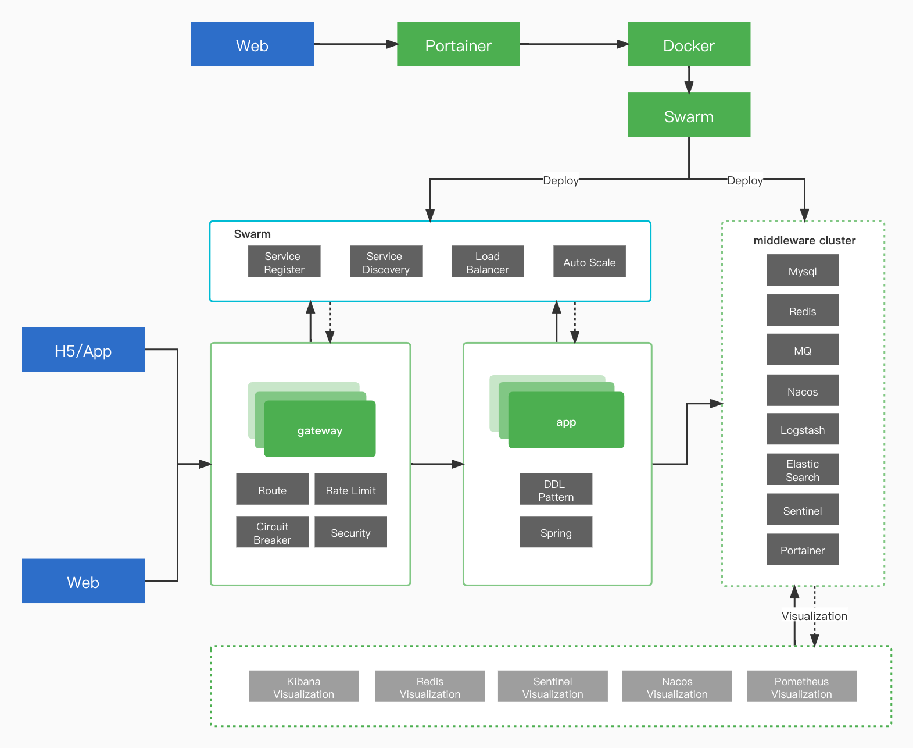

[](https://circleci.com/gh/ThoughtsBeta/flash-sale/tree/master)
[]()
[](http://isitmaintained.com/project/ThoughtsBeta/flash-sale "Average time to resolve an issue") 
[](http://isitmaintained.com/project/ThoughtsBeta/flash-sale "Percentage of issues still open") 


# High Concurrency Flash Sale Architecture

**Core specialist In Source Code**

* Complete application based on Spring Boot and Spring Cloud；
* DDL Design pattern and practice;
* Using L2 cache architecture【Local Cache and Distributed Cache】；
* Sync place order and high-concurrency stock deduction；
* Async place order and high-concurrency stock deduction；
* Sub-database and sub-table；
* limit request rate using gateway and redis；
* security and risk management policy；
* practice of circuit-breaker；
* Docker, Swarm, CI/CD and monitor；
* Redis+Nacos+RocketMQ+ELK；

**High-Concurrency Architecture Graph**



## tech overview

* Spring Boot，Spring Cloud Gateway，Srping Cloud  Sleuth
* MySQL+Mybatis
* Redis
* Junit
* Docker
* Swarm、Portainer
* Prometheus、Grafana
* Sentinel
* Nacos
* Elasticsearch、Logstash、Kibana
* Postman+Jmeter

## how to run application

We use the docker compose to manage our middleware.
So it is possible to run middleware easily in local.
There are 4 docker compose files in `environmet` file:

* **docker-compose.yml**：【completed version】run `docker-compose -f docker-compose.yml up` to install and run all middlewares which is dependent in our project;
* **docker-compose-light.yml**：【light version】run `docker-compose -f docker-compose-light.yml up` to test and run application;
* **docker-cluster-middlewares.yml**：【deploy middleware-cluster】;
* **docker-cluster-apps.yml**：【deploy app-cluster】;
* **config**: Prometheus and MYSQL's configuration；
* **grafana-storage**: grafana configuration；
* **data**: mysql files

## initialization 

We have put initialization sql files in `enviroment/config/mysql`

```
.
├── config
│   └── mysql
│   	  └── init
│   	      ├── flash_sale_init.sql
│   	      ├── flash_sale_init_sharding_0.sql
│   	      ├── flash_sale_init_sharding_1.sql
│   	      └── nacos_init.sql
├── docker-cluster-apps.yml
├── docker-cluster-middlewares.yml
├── docker-compose-light.yml
└── docker-compose.yml
```
### Step1: run middleware by docker-compose.yml
1. go into `environment` file, run `docker-compose -f docker-compose-light.yml up`;
2. run `docker-compose -f docker-compose-light.yml down` to stop all running containers if needed;
3. run `docker-compose -f docker-compose-light.yml up --force-recreate` to recreate all containers;

### Step2: run application by idea
1. run `./mvnw clean install` to install dependencies(use [mvnd](https://github.com/apache/maven-mvnd) to be faster);
2. run `com.actionworks.flashsale.FlashSaleApplication` in start module;
>**Notice**
> use local property when running locally


**Optional：use Docker to run**


1. build docker image

```shell
docker build -t flash-sale-app . 
```

2. add `docker-compose.yml`

```yml
services:
  flash-sale-app:
    image: flash-sale-app
    container_name: flash-sale-app
    environment:
      - SPRING_PROFILES_ACTIVE=docker
    ports:
      - 8090:8090
    networks:
      - thoughts-beta-cluster-apps
    restart: on-failure
  flash-sale-gateway:
    image: flash-sale-gateway
    container_name: flash-sale-gateway
    environment:
      - SPRING_PROFILES_ACTIVE=docker
    ports:
      - 8080:8080
    networks:
      - thoughts-beta-cluster-apps
    restart: on-failure
```

## test

We recommend to use Postman to test restful api

```shell
├── environment
│   ├── config
│   ├── data
│   ├── docker-compose.yml
│   └── grafana-storage
└── postman
    └── flash-sale-postman.json # test json
```
